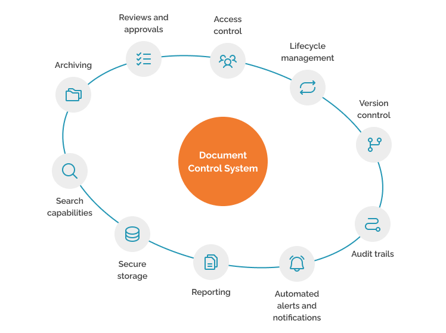
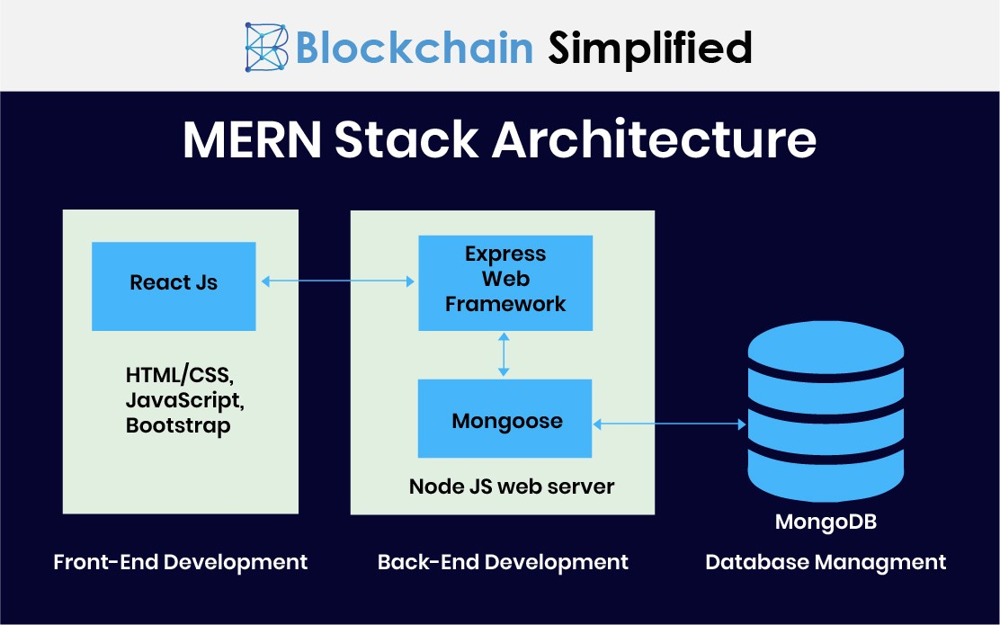
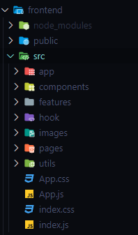
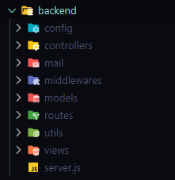

# T3A1-Workbook

## Q1	Provide an overview and description of a standard source control process for a large project

[Source: Byrne, Joe. “What Is a Document Control System and Why Is It Important?” ](www.cognidox.com/blog/what-is-a-document-control-system)

A standard control process is a structured system used to manage and track changes to a codebase, documentation and digital assets which is essential for large projects. This generally involves using various tools that allow a multiple developers to collaborate efficiently, maintain quality codebase and project stability as a project expands in complexity overtime. [[2]](aws.amazon.com/devops/source-control/)

As shown in the image above, here is a breakdown on a source control process which is recommended especially for larger projects:

1. **Version tracking**
To be able to enable each developer to have a complete copy of the repository and enabling seamless integration of changes. This helps teams to also track changes to a code, compare versions and revert changes if mistakes are made. [[3]](www.atlassian.com/git/tutorials/what-is-version-control)

2. **Branching Strategy** 
This can be broken down to three strategies: Feature, Release and Hotfix branching.

    - Branching a feature allows developers to designate individual features or tasks amongst the team, which reduces the risk of conflicts and improves efficiency.
    - When the project is ready, it is released as a seperate, overall branch (for example, release version 1.0) and is based on the main branch of the project. 
    - Lastly, any hotfixes that is made to a project after the initial release is made to address any issues without interfering with the work that is currently in progress in the develop branch. [[4]](docs.github.com/en/get-started/using-github/github-flow) [[5]](www.atlassian.com/git/tutorials/comparing-workflows)

3. **Collaboration** 
Collaboration between developers allow reviewing of changes before intergrating into the main project branch to allow discussions of code quality and information. [[6]](http://www.3pillarglobal.com/insights/blog/the-importance-of-code-reviews/) To integrate their ideas and evaluations, developers are able to make pull/merge requests [[7]](http://www.3pillarglobal.com/insights/blog/the-importance-of-code-reviews/) to process changes and allowing further discussions and reviews before approval. This also aligns with the steps of auditing and monitoring as developers are able to track and identify any issues that arises. [[8]](docs.github.com/en/organizations/keeping-your-organization-secure/managing-security-settings-for-your-organization/reviewing-the-audit-log-for-your-organization)

4. **Commit Practices** 
By providing clear, concise and meaningful commits makes it easier to understand the changes made to the project as it describes the 'what' and 'why', aiding developers to reference and provide any feedback/changes. [[9]](daily.dev/blog/git-best-practices-effective-source-control-management)

5. **Access Control** 
This defines the roles within the project such as who is the developer, reviewer, etc. This will provide specific permissions to ensure security and accountability of their work. [[10]](www.microsoft.com/en-au/security/business/security-101/what-is-access-control)

6. **Documentation** 
By document the source control processes of a project, it allows developers to maintain consistency by understanding the entirety of the source control process, additionally providing guidelines, standards and facilate improvements. This is especially important in large projects and organizations. [[11]](daily.dev/blog/documentation-version-control-best-practices-2024)

## Q2	What are the most important aspects of quality software?

1. **Functionality**
This is the capability of softwares to fulfill its intended purposes and ensuring it performs the tasks accurately and correctly designed for, meeting the user's expectations (such as its intended features and functions of a software). Furthermore, it involves the identification and removal of any errors in the software to improve functionality. 
For example, in financial applications, the software is required to correctly process transactions, calculate finances and provide financial security to protect the user and avoid any financial errors.

2. **Reliability**
It is the ability to operate without failure and behaves consistently as intended and errors should be minimized as much as possible. The key to reliability is through stability, fault tolerence and recoverability.
    - Stability: Able to run a software consistently and predictably dependable without running into unexpected errors.
    - Fault Tolerance: The ability to continue functioning even when some parts of the software experience issues.
    - Recoverability: To quickly restore normal operations of a software after failure or errors with minimal downtime.
For example, the usage of messenger applications such as WhatsApp, user's expectations is to be able to rely and depend on the application to send and receive messages without any issues.

3. **Usability**
This refers to the user's experience, giving them the ability to use the software with ease, learn how to operate and accomplish the intended tasks efficiently and effectively, granting user satisfaction. For example, the software should not require excessive configuration and the complexity of a software should not require user to look up how to use the software on the internet. 
For example, a food delivery application should allow user's to easily use and search for restaurants by categories, easy usage of the search engine to find specific dishes or cuisines and navigation of the support system to contact or search for answers to their problems.

4. **Efficiency**
Efficiency is the trait of a software, allowing it to perform its functions optimally, requiring and utilizing the least amount of resources possible such as CPU, memory and network bandwidth. This is typically noticable on applications such as streaming applications. To be able to stream a video without any lag, which is measured dependantly on the user's network bandwidth.

5. **Modifiability/Maintainability**
Is to be able to add or change the behaviour of a system software, resulting in the reduction of cost and effort into updating such softwares. This additionally makes it easier to adapt the software to meet new requirements or demands of the market.
A good example is the usage of a website. A developer can easily add new features, fix bugs or update the design and/or functionality without interupting the website's functionality, reducing the risk of potential downtime and satisfaction of the users.

6. **Portability**
Portability refers to the ability of the software to run on various platforms or adapt to different environments without any extensive modifications to the software itself, giving it a trait of adaptability and flexibility as well. A great example is being able to run a web application software on different operating systems such as Windows, macOS and Linux or viewing different dimensions on different devices whether it is on a computer monitor, mobile device or tablet. [[12]](http://www.silasreinagel.com/blog/2016/11/15/the-seven-aspects-of-software-quality/) [[13]](http://www.indeed.com/career-advice/career-development/metrics-for-software-quality) [[14]](testsigma.com/blog/software-quality-attributes/)

## Q3	Outline a standard high level structure for a MERN stack application and explain the components

 
[[Source: “What Is MERN Stack?” Blockchain Simplified]](blockchainsimplified.com/blog/what-is-mern-stack/)

A standard high-level structure for a **MERN** stack application includes **M**ongoDB, **E**xpress.js, **R**eact and **N**ode.js. It is designed to separate concerns and organize code for scalability, maintainability, and efficient data flow between the frontend (client) and backend(server). The structure follows the Model-View-Controller(MVC), which:

- **Model**: Manages the data within the database of an application. In MERN, this refers to the usage of MongoDB to store the data and is typically hosted seperately, either locally or through a cloud service.
- **View**: To display and render the data to the users. This is usually the frontend framework (client) and in MERN, it uses React.js as its framework.
- **Controller**: Handling the user's input and updating the model and view components accordingly, which refers to the functions of HTTP requests and responses. In MERN stack, this is built through the backend (server) using Node.js and Express.js. [[15]](blockchainsimplified.com/blog/what-is-mern-stack/)

This high-level structure divides responsibilities, allowing developers to scale and maintain each part of the application independently, just as Facebook for example, manages separate layers for posts, users, messages, and notifications. This modularity keeps the code organized and helps ensure smooth interactions between the frontend, backend, and database in a large-scale application.

The usage of this structure in a high level for a MERN stack application, the outline of the structure, component and elements using Facebook as an example is as follows:

1. **Client (Front-End)**

    

    [Source: Amankwah, Kingsley. “MERN Stack Project Structure: Best Practices.” DEV Community, 27 Mar. 2023](dev.to/kingsley/mern-stack-project-structure-best-practices-2adk)

    Using Facebook as as example, the frontend is built using React as it's framework to handle user interfaces, allowing them to interact with elements such as posts, profiles, friend requests, etc.

    - `/public`: This stores static files such as the index.html, where the React app is rendered. This HTML file might include meta tags and links to scripts necessary for React.

    - `/src`: This will contain the core code for the frontend application using React.

        - `/components`: Contains reusable components such as;
            - `Post.js`: Renders a post with options to like, comment, and share.
            - `Comment.js`: Displays a comment, allowing users to reply or react.
            - `Navbar.js`: A navigation bar that includes search, notifications, and user profile links.
            - `FriendRequest.js`: Handles incoming friend requests, allowing the user to accept or reject them.
        - `/pages`: Contains page-level components, each representing a full page view.
            - `Feed.js`: Shows a timeline or feed of posts from friends.
            - `Profile.js`: Displays a user’s profile, including posts, friends, and profile information.
            - `Messages.js`: A page where users can message each other.
        - `/utils:` Holds utility functions such as API calls and helper functions to format dates, process images, etc.
            - `App.js:` The main component of the React app where routes are set up. Routes link to different pages (e.g., Feed, Profile).
            - `index.js:` The entry point for the React app, where the App component is rendered to the DOM.

2. **Server(Back-End)**

    

    [Source: Amankwah, Kingsley. “MERN Stack Project Structure: Best Practices.” DEV Community, 27 Mar. 2023](dev.to/kingsley/mern-stack-project-structure-best-practices-2adk)

    The Node.js and Express backend provides RESTful APIs for handling data requests, authentication, and interactions with the MongoDB database.

    - `/config`: Holds configuration files, like MongoDB connection setup or environment configurations.

    - `/controllers`: Manages the application's business logic and processes requests from the client.
        - `UserController.js`: Handles actions related to user accounts, like registration, login, profile updates, and friend requests.
        - `PostController.js`: Manages post-related actions, such as creating, deleting, liking, or commenting on posts.
        - `MessageController.js`: Handles messaging functionality, including sending and retrieving messages.
        - `NotificationController.js`: Manages notifications, such as when someone likes a post or sends a friend request.

    - `/models`: Defines the structure of data stored in the database using Mongoose schemas.
        - `User.js`: Defines the user schema, which includes fields like username, email, password, friends, profilePicture, and bio.
        - `Post.js`: Defines the post schema, including fields for content, author, likes, comments, and timestamps.
        - `Message.js`: Represents a message schema, including sender, receiver, content, and timestamp.
        - `Notification.js`: Contains notifications related to user activity, such as new likes, comments, or friend requests.

    - `/routes`: Defines the URL endpoints and HTTP methods for accessing resources in the backend.
        - `userRoutes.js`: Defines routes related to user actions, such as logging in, registering, and managing friends.
        - `postRoutes.js`: Defines routes for post-related actions, like creating, updating, or deleting posts.
        - `messageRoutes.js`: Routes for sending and retrieving messages.
        - `notificationRoutes.js`: Routes to fetch notifications.

    - `/middlewares`: Contains reusable middleware functions that perform tasks before requests reach the controllers.
        - `authMiddleware.js`: Checks if the user is authenticated before allowing access to certain routes (e.g., posting, messaging).
        - `errorMiddleware.js`: Handles errors globally, providing appropriate error messages for client-side requests.
        - `server.js`: The entry point of the backend application where Express is initialized, middleware is set up, routes are registered, and the MongoDB database connection is established.

    - `.env`: Stores sensitive information like the MongoDB URI and JWT secrets, protecting them from exposure in the codebase.

3. **Database (MongoDB)**

    In this Facebook-like application, MongoDB serves as the database, managing collections of documents for each model (e.g., users, posts, messages). MongoDB’s flexible schema is ideal for managing user-generated content and evolving structures, which can be especially beneficial in a social media application where requirements may change. [[16]](dev.to/kingsley/mern-stack-project-structure-best-practices-2adk)

Lastly, this is generally all contained within the root of project folder containing files such as `.gitignore`, `README.md` and the overall `package.json` files which contains configurations and dependancies for the entirety of the project application. 

## Q4	A team is about to engage in a project, developing a website for a small business. What knowledge and skills would they need in order to develop the project?

Developing a quality website for a small business requires a multidisciplinary approach, including technical web development, design, UX/UI (user experience and interface), project management, SEO, & security. Each team member of the development should bring specialized skills, working collaboratively to deliver a high-quality product. [[17]](http://www.uptech.team/blog/web-development-team) [[18]](http://www.indeed.com/career-advice/career-development/web-developer-skills)

To break down each area of knowledge and expertise:

1. **Web Development Skills**

    - **Front-End Development**: Front-End Developer

        A Front-End Developer builds website structure, style, and interactivity using HTML, CSS, and JavaScript. They ensure responsive design with CSS media queries or frameworks like Bootstrap and Tailwind for mobile-friendliness. Familiarity with frameworks like React, Vue.js, or Angular enhances efficiency for creating interactive websites.

    - **Back-End Development**: Back-End Developer

        A Back-End Developer specializes in server-side languages like Node.js, Python, or PHP for managing server logic and data processing, along with database management (e.g., MySQL, PostgreSQL, MongoDB) for data storage and retrieval. They also develop APIs (RESTful or GraphQL) for client-server communication. In smaller businesses, Full-Stack Developers often handle both front-end and back-end tasks.

    There are some situations within a small business and/or team where they will utilize and hire a full-stack developer to handle both front-end and back-end.

2. **Design, User Interface(UI) and User Experience (UX)**: UI/UX Designer, Graphic Designer, Content Stategist

    A UI/UX Designer or Graphic Designer uses tools like Adobe XD, Figma, or Sketch to create visually engaging layouts and design elements aligned with the brand. They focus on UX principles, user flows, and accessibility to enhance usability. Content Strategists also contribute, ensuring effective communication through content planning and sometimes copywriting.

3. **Project Management and Collaboration** Project Manager

    A Project Manager uses methodologies like Agile or Scrum for project planning, breaking down tasks, setting milestones, and managing timelines. They utilize version control tools (e.g., Git, GitHub) for tracking changes and project management tools (e.g., Trello, Asana, Jira) along with communication tools (e.g., Slack, Microsoft Teams) to ensure efficient collaboration and progress tracking.

4. **SEO and Digital Marketing Knowledge** - SEO Specialist, Digital Marketing Specialist

    An SEO or Digital Marketing Specialist focuses on on-page SEO practices (e.g., meta tags, keywords, image optimization) to boost search engine visibility. They also use tools like Google Analytics and set up conversion tracking to analyze user behavior and measure website performance.

5. **Security and Compliance** - Security Engineer

    A Security Engineer ensures website security through practices like HTTPS, data validation, and protection against vulnerabilities (e.g., XSS, CSRF). They also maintain privacy compliance by adhering to data regulations (e.g., GDPR) to handle user data responsibly. Although, in some cases, a Back-End Engineer will handle security tasks that is limited to fundemental security practices as they also often work on implementing and contributing to overall security.

## Q5	With reference to one of your own projects, discuss what knowledge or skills were required to complete your project, and to overcome challenges

**source** : https://github.com/montsieur/Pokemon-TCG-Tracker

This project was to create an API webserver and what I chose to do was to create a Pokemon Trading Card Game Tracker. I relied on what I have learnt through class and researched further on how I can improve my project to ensure the result was satisfactory. Although, there were numerous challenges I faced due to the unfamilarity of creating an entire API webserver, but through foundations of Python, Flask, SQLAlchemy, Marshmallow, Error Handling, JSON Web Tokens, Environment Management and Version control that I have learnt, I was able to finish the project.

1. **Python & Flask**

    This project was built using Python and with the Flask Framework. The knowledge of using Flask's applications such as blueprints, creating routes and implementing middleware was essential to organize the project and maintain modularity. I developed an understanding of request and response cycles and how to handle HTTP methods such as `GET`, `POST`, `PUT`, `PATCH` and `DELETE`.

2. **Database Management**

    For database management, I used SQLAlchemy for Object Relational Mapping (ORM) and PostGreSQL as the database. This required me to understand how to define models, setting up relationships between entities and perform CRUD operations (`Create`, `Read`, `Update`, `Delete`) whilst normalizing data tables to ensure that data storage was efficient and minimize redundancy as much as possible.

3. **Data Serialization & Validation**

    I utilized Marshmallow for data serialization which is vital to exchange data between the frontend and backend. I learned how to make schemas for each model and apply validation rules such as ensuring a valid email format was used or the length of the user's username to main data integrity.

4. **Authentication & Authorization**

    Through the usage of JSON Web Tokens, I implemented authentication to secure user sessions and validate permissions. For example, giving administration authorization and accessibilty to certain users.

5. **Error Handling**

    I implemented exception handling for database operations to manage issues like integrity violations or missing resources, and validation to ensure all required data was provided.

I overcame the challenges of creating this project through perseverance and constant problem-solving such as creating the database relationships, how it interacted amongst each other. For example users, cards and trades models were initially complex as it worked across multiple models and how to further normalize it. By studying SQLAlchemy repeatedly, finding examples and receiving feedback from my lecturers whilst I was designing my project's ERD, I was able to reference and understand how to configure the relationships between models. 

Handling errors was also disheartening when implementing new snippets of code and features, sometimes making the entire project redundant. Although, everytime I came across an error, I will carefully read the error to try and pinpoint it within the code to debug/fix the issue resulting in satisfaction. At the same time, when I notice flaws within the code whilst debugging, I attempt to go through the project again to see what I missed and improve the project as much as I can.

## Q6	With reference to one of your own projects, evaluate how effective your knowledge and skills were for this project, and suggest changes or improvements for future projects of a similar nature

**source** : same as question 5.

Reflecting on my project, I felt my knowledge and skills were effective but still within its early stages, as I identified areas where further refinement could improve my approach to future projects. Such as:

1. **Flask**

    While my project grew in size, I noticed the need for additional scalability and code maintainance, becoming more difficult to manage. To improve on this point, I researched the implementation of Flask's application factory pattern [[19]](flask.palletsprojects.com/en/stable/patterns/appfactories/) which would allow me to load configurations that is more sutied to multiple environments which will help in developement and testing.

2. **Database Management**

    I applied SQLAlchemy effectively to model complex relationships among users, cards, trades, and wishlists. However, I occasionally struggled with designing queries for more intricate relationships. For example, by quering across multiple joins, it sometimes will lead to calling in the database inefficiently or sometimes overlapping making it unclear. I believe by learning more about SQLAlchemy into advanced query optimization could potentially improve the project's performance such as using hybrid properties. 
    
    For example:

    To calculate the value of each card inside the Card model with `rarity_id` and `condition_id` fields, I can access the values within those fields together into a new property `value` and store it in the database.

3. **Data Serialization & Validation**

    I found it quite challenging to manage dependancies among schemas and nested relationships. Moving forward, I hope to explore and approach restructuring schemas into a seperate package to handle dependancies more effectively.

4. **Authentication & Authorization**

    Using JWT authentication helped me implement secure routes and restrict access to users. However, I believe managing roles and permissions with custom decorators became complex and the role expanded. I researched on Auth0's role-based access control (RBAC) [[20]](https://auth0.com/docs/manage-users/access-control/rbac) system and hoped to implement it to handle permissions more efficiently.

5. **Error Handling**

    My error handling provided useful feedback for common issues, but I realized that more detailed logging would improve debugging and that I missed some error handling at some parts of the code. Next time, I’d use structured logging to better organize and track errors, making it easier to identify and fix issues for my projects.

If I were to improve my further projects or this particular project, I will attempt to add features such as:

1. **Frontend Frameworks**

    To make the app user-friendly, I’d add a frontend using React or Vue.js for a responsive interface. This would allow users to interact with the API easily, viewing cards, trades, and account details.

2. **Create a User Interface**

    For a more polished look, I’d use a CSS framework like Bootstrap, adding responsive design, filters, and status indicators to improve usability. 

By improving, learning and implementing further knowledge and skills, I hope to fully realize this project and future projects in creating a full-featured, user friendly web API.

## Q7	Explain control flow, using an example from the JavaScript programming language

Control flow in programming refers to the order in which individual statements, instructions, or function calls are executed or evaluated. In JavaScript, control flow determines how code runs from start to finish, and it’s primarily managed through constructs such as conditional statements, loops, and functions. [[21]](javascript.info/function-basics)

1. **Sequential Flow**

    In JavaScript, code runs from top to bottom by default, executing one statement after another. 
    
    For example:

        let name = "Van";
        console.log("Hello, " + name);
        console.log("How are you today?");

        Output:
        Hello, Van
        How are you today?

2. **Conditional Statements**

    Conditional statements allow for decision-making in the code based on certain conditions, using `if`, `else if`, and `else`.

    For example:

        let temperature = 25;

        if (temperature > 30) {
            console.log("It's a hot day!");
        } else if (temperature > 20) {
            console.log("It's a nice day.");
        } else {
            console.log("It's cold outside.");
        }

    In this example, 

    `if` the temperature is above `30`, the code logs `"It's a hot day!"` and exits the conditional structure. 

    `else if` temperature is between `21` and `30`, it logs `"It's a nice day."`. 

    `else`, it logs `"It's cold outside."`

3. **Loops**

    Loops in JavaScript allow for repeated execution of code blocks as long as a specified condition is true. Common loops include for, while, and do...while.

        for (let i = 0; i < 5; i++) {
            console.log("Count: " + i);
        }

    Here, the control flow starts by initializing `i` to `0` and repeats the block of code (logging Count: `i`) until `i` reaches `5`. Each iteration updates the value of `i`, ensuring the loop eventually exits. 

4. **Functions and Function Calls**

    Functions in JavaScript are reusable code blocks that are executed when called. Control flow moves into the function when it is called and returns to the main flow once the function completes.

        function greet(name) {
            console.log("Hello, " + name);
        }

        greet("Van");

    When `greet("Van")` is called, control flow enters the function, logs `"Hello, Van,"` and then returns to the main flow of code.

## Q8	Explain type coercion, using examples from the JavaScript programming language

Type coercion in JavaScript is the automatic or implicit conversion of values from one data type to another. JavaScript is a loosely typed language, meaning variables aren’t directly associated with any specific data type. Therefore, when operations involve mixed types, JavaScript often coerces types to ensure compatibility. [[22]](javascript.info/type-conversions)

There are two main types of type coercion: implicit coercion which is handled automatically and explicit coercion where it is converted manually instead.

1. **Implicit Coercion**

    JavaScript automatically performs type coercion in certain situations, often during operations involving different data types. Implicit coercion commonly occurs with operators like `+, -, ==`, and logical operators.

    For Example

    - **String Coercion** 
    
        With `+` Operator If you use the `+` operator with a string and a number, JavaScript coerces the number to a string.

            let result = "5" + 10; 

            Output:
            "510"

    In this case, JavaScript converts `10` to `"10"`, then concatenates it with `"5"`, resulting in `"510"`.

    - **Boolean Coercion** 
    
        When using logical operators like `&&, ||, or !`, JavaScript coerces values to booleans. Falsy values (e.g., `0`, `""`, `null`, `undefined`, `NaN`) become false, while truthy values become true.

            let value = "hello" && 0;

            Output:
            0

        Here, `"hello"` is truth-like, but `&&` requires both sides to be true, so it evaluates to the last falsy value, `0`.

    - **Numeric Coercion** 

        With `-` Operator When using the `-` operator between a string and a number, JavaScript attempts to convert the string to a number.

            let result = "10" - 5;

            Output:
            5

        JavaScript converts `"10"` to `10`, then subtracts `5`, resulting in `5`.

2. **Explicit Coercion**

    In explicit coercion, developers manually convert values to desired types using JavaScript functions or constructors.

    For Example:

    - **String Conversion** 
    
        Uses `String()` or `.toString()` to convert other types to strings.

            let num = 10;
            let str = String(num);

            Output:
            "10"

    - **Number Conversion** 

        Uses `Number()`, `parseInt()`, or `parseFloat()` to convert strings to numbers.

            let str = "42";
            let num = Number(str);

            Output:
            42

    - **Boolean Conversion** 

        Uses `Boolean()` to convert values to a boolean.

            let value = Boolean(1); 

            Output: 
            True

## Q9	Explain data types, using examples from the JavaScript programming language

Data types in JavaScript specify the kind of values that variables can hold. JavaScript has several core data types, broadly categorized into primitive and non-primitive (or reference) types. [[23]](http://www.w3schools.com/js/js_datatypes.asp)

1. **Primitive Data Types**

    Primitive types are immutable and represent single values. They include:

    - **String**: Represents text and is enclosed in quotes.

            let name = "Van";

    - **Number**: Represents both integer and as a float.

            let age = 33;
            let height = 5.8;

    - **Boolean**: Only taking values either true or false.

            let isStudent = true;

    - **Null**: Represents an intentional absence of any value.

            let result = null;

    - **Undefined**: Represents a variable that has been declared but not assigned a value.

            let score;

    - **Symbol**: Represents a unique and immutable identifier, often used as object keys.

            let sym = Symbol("uniqueIdentifier");

    - **BigInt**: For representing integers beyond the safe range of Number.

            let bigIntNum = 123456789012345678901234567890n;

2. **Non-Primitive (Reference) Data Types**

    Non-Primitive or Reference data types are objects, which can store collections of data and more complex entities.

    - **Object**: Stores collections of key-value pairs and can hold other data types as properties.

            let person = {
                name: "Van",
                age: 33,
                isStudent: true
            };

    - **Array**: A special type of object for ordered lists of values.

            let colors = ["red", "green", "blue"];

    - **Function**: Functions are a type of object in JavaScript. They contain code that can be called and reused.

            function greet() {
                return "Hello!";
            }

3. **Type Checking**

    To check a variable’s data type, JavaScript provides the `typeof` operator:

            console.log(typeof "hello"); 
            Output: "string"

            console.log(typeof 123); 
            Output: "number"

            console.log(typeof true); 
            Output: "boolean"

            console.log(typeof {}); 
            Output: "object"

            console.log(typeof undefined); 
            Output: "undefined"

            console.log(typeof null); 
            Output: "object" 
   
## Q10	Explain how arrays can be manipulated in JavaScript, using examples from the JavaScript programming language

Arrays in JavaScript are versatile structures that allow the storage and manipulation of ordered lists of elements. JavaScript provides numerous methods to add, remove, sort, and transform array elements, making arrays an essential part of the language. [[24]](http://www.freecodecamp.org/news/javascript-array-tutorial-array-methods-in-js/)

1. **Adding Elements**
    You can add elements to an array using methods like `push()`, `unshift()`, and `splice()`. We will continue to add using the manipulative features below from the first set of code example.

    - `push()`: Adds one or more elements to the end of the array.

            let colors = ["red", "green"];
            colors.push("blue");
            console.log(colors);
            
            Output:
            ["red", "green", "blue"]

    - `unshift()`: Adds elements to the beginning of the array.

            colors.unshift("yellow");
            console.log(colors); 
            
            Output:
            ["yellow", "red", "green", "blue"]

    - `splice()`: Adds elements at a specific index.

            colors.splice(2, 0, "purple"); // Insert "purple" at index 2
            console.log(colors);
            
            Output:
            ["yellow", "red", "purple", "green", "blue"]

2. **Removing Elements**

    JavaScript provides methods like `pop()`, `shift()`, and `splice()` to remove elements in an array.

    - `pop()`: Removes the last element of the array.

            colors.pop()`;
            console.log(colors);
            
            Output:
            ["yellow", "red", "purple", "green"]

    - `shift()`: Removes the first element of the array.

            colors.shift();
            console.log(colors);
            
            Output:
            ["red", "purple", "green"]

    - `splice()`: Removes elements at a specified index.

            colors.splice(1, 1); // Remove one element at index 1
            console.log(colors); 
            
            Output:
            ["red", "green"]

3. **Finding and Accessing Elements**

    Methods like `indexOf()`, `includes()`, and `find()` help locate elements in an array.

    - `indexOf()`: Finds the index of a specific element (returns -1 if not found).

            let index = colors.indexOf("green");
            console.log(index); 
            
            Output:
            1

    - `includes()`: Checks if an array contains a specific element.

            let hasRed = colors.includes("red");
            console.log(hasRed); 
            
            Output:
            true

    - `find()`: Returns the first element that satisfies a given condition.

            let longColor = colors.find(color => color.length > 3);
            console.log(longColor); 
            
            Output:
            "green"

4. **Transforming Arrays**

    JavaScript provides methods like `map()`, `filter()`, and `reduce()` for transforming arrays.

    - `map()`: Creates a new array by applying a function to each element.

            let upperColors = colors.map(color => color.toUpperCase());
            console.log(upperColors); 
            
            Output:
            ["RED", "GREEN"]

    - `filter()`: Creates a new array with elements that pass a condition.

            let shortColors = colors.filter(color => color.length <= 4);
            console.log(shortColors); 
            
            Output:
            ["red"]

    - `reduce()`: Reduces the array to a single value by applying a function to each element cumulatively.

            let totalLength = colors.reduce((sum, color) => sum + color.length, 0);
            console.log(totalLength); 
            
            Output:
            8

5. **Sorting and Reversing Arrays**

    The `sort()` and `reverse()` methods enable sorting and reversing elements in an array.

    - `sort()`: Sorts elements in place.

            let numbers = [3, 1, 4, 2];
            numbers.sort();
            console.log(numbers); 
            
            Output:
            [1, 2, 3, 4]

    - `reverse()`: Reverses the array order.

            numbers.reverse();
            console.log(numbers); 
            
            Output:
            [4, 3, 2, 1]

## Q11	Explain how objects can be manipulated in JavaScript, using examples from the JavaScript programming language

Objects in JavaScript are a powerful and flexible data structure that allows developers to store collections of related data using key-value pairs. JavaScript provides various methods for manipulating objects, from adding and removing properties to iterating over them and cloning them. Similar to question 10, we will use the first set of code to add different properties and how we can manipulate it. [[25]](Javascript.info, javascript.info/object)

1. **Adding and Updating Properties**

    To add or update properties in an object, you can use either dot notation or bracket notation.

    - **Dot Notation**:

            let person = { name: "Van", age: 33 };
            person.location = "Sydney"; // Adds a new property
            person.age = 34; // Updates an existing property
            console.log(person); 
            
            Output:
            { name: "Van", age: 34, location: "Sydney" }

    - **Bracket Notation**:

            person["profession"] = "Developer";
            console.log(person); 
            
            Output:
            { name: "Van", age: 34, location: "Sydney", profession: "Developer" }

2. **Deleting Properties**

    To remove a property, use the `delete` operator.

        delete person.location;
        console.log(person); 
        
        Output:
        { name: "Van", age: 34, profession: "Developer" }

3. **Checking for Properties**

    You can check if a property exists using the `in` operator or `hasOwnProperty()` method.

    - `in` **Operator**: This checks if a specified property exists within an object and returns `true` or `false` in both properties and inherited properties.

            console.log("age" in person);

            Output:
            true

            console.log("location" in person); 
            
            Output:
            false

    - `hasOwnProperty()`: Unlike `in`, it will check whether an object has a specific property of its own. It returns `true` if it exists directly on the object, otherwise returns `false`.

            console.log(person.hasOwnProperty("profession")); 
            
            Output:
            true

4. **Iterating Over Properties**

    JavaScript provides ways to loop through an object’s properties.

    - `for...in` **Loop**: Useful for iterating over all properties, including inherited ones.

            for (let key in person) {
            console.log(key + ": " + person[key]);
            }

            Output:
            name: Van
            age: 34
            profession: Developer

    - `Object.keys()`: Returns an array of the object’s keys, allowing use with forEach or map.

            Object.keys(person).forEach(key => {
            console.log(key + ": " + person[key]);
            });

            Output:
            name: Van
            age: 34
            profession: Developer

5. **Merging Objects**

    You can combine multiple objects using Object.assign() or the spread operator.

    - `Object.assign()`: Copies properties from one or more source objects into a targeted object and returns the modified targeted object.

            let job = { title: "Engineer", years: 1 };
            let updatedPerson = Object.assign({}, person, job);
            console.log(updatedPerson); 
            
            Output:
            { name: "Van", age: 34, profession: "Developer", title: "Engineer", years: 1 }

    - `...` **Spread Operator**: A syntax for expanding or unpacking elements in an array, object and function arguements.

            let updatedPerson = { ...person, ...job };
            
            Output:
            { name: "Van", age: 34, profession: "Developer", title: "Engineer", years: 1 }

6. **Cloning Objects**

    Unlike merging, cloning only creates an exact copy of an object or array rather than combining multiple objects or arrays.

    To create a copy of an object, use `Object.assign()` or the `...` spread operator. 

        let clone = { ...person };
        clone.name = "David"; // Only affects the clone
        console.log(person.name); 
        
        Output:
        "Van"

7. **Transforming Objects**

    JavaScript does not have a built-in method for transforming objects like arrays, but you can use Object.entries() with array methods to achieve similar results.

    - **Converting Object Properties to Uppercase**:

            let upperCasePerson = Object.fromEntries(
            Object.entries(person).map(([key, value]) => [key.toUpperCase(), value])
            );
            console.log(upperCasePerson);

            Output:
            { NAME: "Van", AGE: 34, PROFESSION: "Developer" }

8. **Object Destructuring**

    Destructuring lets you extract values from objects directly into variables, which can be very useful for simplifying code.

        let { name, age } = person;
        console.log(name); 
        
        Output:
        "Van"

        console.log(age); 
        Output:
        34

JavaScript provides numerous ways to manipulate objects, including adding, updating, deleting, and merging properties, as well as iterating, cloning, and transforming objects. These tools make objects a flexible and central structure in JavaScript programming.

## Q12	Explain how JSON can be manipulated in JavaScript, using examples from the JavaScript programming language

JSON, also known as JavaScript Object Notation, is a lightweight data-interchange format that uses JavaScript syntax to represent structured data. JSON is often used for data transfer between a server and a client in web applications that can be manipulated using two primary methods; `JSON.parse()` for converting JSON strings into JavaScript objects, and `JSON.stringify()` for converting JavaScript objects into JSON strings. [[26]](javascript.info/json)

JavaScript provides additional options for pretty-printing, selective stringification, and handling nested JSON, making it highly flexible for working with JSON data.

1. **Parsing JSON Data**

    To work with JSON data in JavaScript, use the `JSON.parse()` method to convert a JSON string into a JavaScript object.

    Example:

        let jsonString = '{"name": "Van", "age": 33, "isStudent": true}';
        let user = JSON.parse(jsonString);

        console.log(user.name); 

        Output: 
        "Van"

        console.log(user.age);  
        
        Output: 
        33

    In this example, the JSON string is parsed into a JavaScript object with properties that can be accessed and manipulated.

2. **Stringifying JavaScript Objects**

    When sending data to a server or storing it as JSON, you’ll need to convert JavaScript objects into JSON strings. Use the `JSON.stringify()` method for this purpose.

    Example:

        let user = { name: "Van", age: 33, isStudent: true };
        let jsonString = JSON.stringify(user);

        console.log(jsonString); 
        
        Output: 
        '{"name":"Van","age":33,"isStudent":true}'

    In this example, the JavaScript object user is converted to a JSON string that can be easily stored or transmitted.

3. **Pretty-Printing JSON**

    When debugging or formatting JSON, `JSON.stringify()` provides an optional parameter for indentation, making it more readable.

    Example:

        let jsonString = JSON.stringify(user, null, 2);
        console.log(jsonString);

        Output:
        {
        "name": "Van",
        "age": 33,
        "isStudent": true
        }

    Adding null as the second parameter and 2 as the third parameter in `JSON.stringify()` pretty-prints the JSON with two-space indentation.

4. **Selective Stringification**

    The `JSON.stringify()` method also allows you to filter specific properties to include in the JSON string by using a replacer function.

    Example:

        let jsonString = JSON.stringify(user, ["name", "age"]);
        console.log(jsonString); 
        
        Output: 
        '{"name":"Van","age":33}'

    In this example, only the name and age properties are included in the output JSON string.

5. **Handling Nested JSON**

    For deeply nested JSON data, JavaScript allows you to access and manipulate nested properties directly after parsing.

    Example:

        let jsonString = '{"person": {"name": "Van", "address": {"city": "Sydney", "zip": "2000"}}}';
        let data = JSON.parse(jsonString);

        console.log(data.person.address.city); 

        Output: 
        "Sydney"

        data.person.address.zip = "2001";

6. **Validating JSON Data**

    To check if a string is valid JSON, you can wrap `JSON.parse()` in a try...catch block. If the string is invalid, an error will be thrown, allowing you to handle it gracefully.

    Example:

        let jsonString = '{"name": "Van", "age": "33"}';

        try {
            let data = JSON.parse(jsonString);
            console.log(data);
        } catch (error) {
            console.log("Invalid JSON:", error.message);
        }

    This approach ensures you only work with properly formatted JSON.

7. **Modifying JSON Data**

    After parsing JSON into a JavaScript object, you can manipulate the data by updating, adding, or deleting properties. Once changes are made, you can use `JSON.stringify()` to convert the object back into JSON format if needed.

    Example:

        let user = JSON.parse('{"name": "Van", "age": 33}');
        user.age = 34; // Update property
        user.location = "Sydney"; // Add property

        let updatedJson = JSON.stringify(user);
        console.log(updatedJson); 
        
        Output: 
        '{"name":"Van","age":34,"location":"Sydney"}'

## References

1. Byrne, Joe. “What Is a Document Control System and Why Is It Important?” Www.cognidox.com, www.cognidox.com/blog/what-is-a-document-control-system.
2. “What Is Source Control? - Amazon Web Services.” Amazon Web Services, Inc., 2019, aws.amazon.com/devops/source-control/.
3. ---. “What Is Version Control.” Atlassian, 2019, www.atlassian.com/git/tutorials/what-is-version-control.
4. “GitHub Flow.” GitHub Docs, docs.github.com/en/get-started/using-github/github-flow.
5. Atlassian. “Git Workflow | Atlassian Git Tutorial.” Atlassian, 2010, www.atlassian.com/git/tutorials/comparing-workflows.
6. “The Importance of Code Reviews - 3Pillar.” 3Pillar, 16 Aug. 2024, www.3pillarglobal.com/insights/blog/the-importance-of-code-reviews/.
7. “Merging a Pull Request.” GitHub Docs, docs.github.com/en/pull-requests/collaborating-with-pull-requests/incorporating-changes-from-a-pull-request/merging-a-pull-request.
8. “Reviewing the Audit Log for Your Organization.” GitHub Docs, docs.github.com/en/organizations/keeping-your-organization-secure/managing-security-settings-for-your-organization/reviewing-the-audit-log-for-your-organization.
9. “Git Best Practices: Effective Source Control Management.” Daily.dev, 2024, daily.dev/blog/git-best-practices-effective-source-control-management. Accessed 15 Nov. 2024.
10. Microsoft. “What Is Access Control? | Microsoft Security.” Www.microsoft.com, www.microsoft.com/en-au/security/business/security-101/what-is-access-control.
11. “Documentation Version Control: Best Practices 2024.” Daily.dev, 2024, daily.dev/blog/documentation-version-control-best-practices-2024.
12. Reinagel, Silas. “The Seven Aspects of Software Quality.” Silas Reinagel, 2016, www.silasreinagel.com/blog/2016/11/15/the-seven-aspects-of-software-quality/.
13. “10 Key Metrics for Software Quality and Why They Matter.” Indeed Career Guide, www.indeed.com/career-advice/career-development/metrics-for-software-quality.
14. Priyanka. “What Are the Software Quality Attributes?” Testsigma Blog, 9 Aug. 2023, testsigma.com/blog/software-quality-attributes/.
15. “What Is MERN Stack?” Blockchain Simplified, blockchainsimplified.com/blog/what-is-mern-stack/.
16. Amankwah, Kingsley. “MERN Stack Project Structure: Best Practices.” DEV Community, 27 Mar. 2023, dev.to/kingsley/mern-stack-project-structure-best-practices-2adk.
17. “Building a Web Development Team - Roles and Responsibilities.” Www.uptech.team, www.uptech.team/blog/web-development-team.
18. “Web Developer Skills: Definitions and Examples.” Indeed Career Guide, www.indeed.com/career-advice/career-development/web-developer-skills.
19. “Application Factories — Flask Documentation (3.1.x).” Palletsprojects.com, 2024, flask.palletsprojects.com/en/stable/patterns/appfactories/. Accessed 17 Nov. 2024.
20. Auth0. “Role-Based Access Control.” Auth0 Docs, 2022, auth0.com/docs/manage-users/access-control/rbac.
21. “Functions.” Javascript.info, javascript.info/function-basics.
22. “Type Conversions.” Javascript.info, javascript.info/type-conversions.
23. W3Schools. “JavaScript Data Types.” W3schools.com, 2020, www.w3schools.com/js/js_datatypes.asp.
24. Cillo, Dario Di. “JavaScript Array Tutorial – Array Methods in JS.” FreeCodeCamp.org, 27 Mar. 2023, www.freecodecamp.org/news/javascript-array-tutorial-array-methods-in-js/. Accessed 16 Nov. 2024.
25. “Objects.” Javascript.info, javascript.info/object.
26. “JSON Methods, ToJSON.” Javascript.info, javascript.info/json.